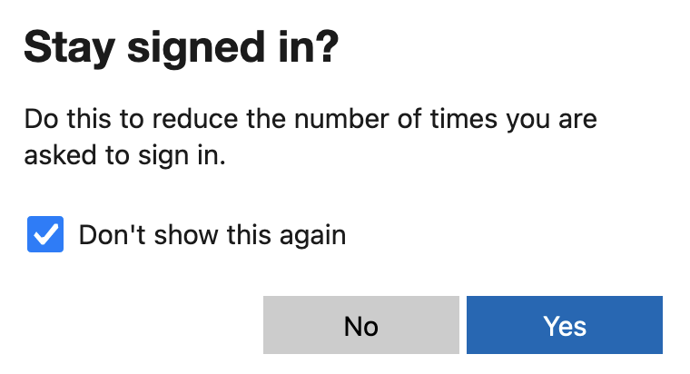

# Microsoft Online: Stay signed in

A Firefox add-on to skip the pesky "Stay signed in?" page in Microsoft Online's login flow.

When logging in to Microsoft Online (e.g. in order to access your work email inbox),
depending on the configuration, you need to go through a few steps (e.g. entering username/password, OTP).
At the very end of this flow, you are asked whether you wanted to stay signed in.
For me, at least, this is _always_ the case, and having to confirm this every time that I am logging in
quickly gets tiresome.

  <a href="https://addons.mozilla.org/firefox/addon/ms-online-stay-signed-in/" target="_blank">
    View on the 🦊 Firefox extension directory
  </a>

This addon automatically ticks the "Don't show this again" checkbox and clicks "Yes" for you,
making sure that you only see the screen for a brief moment and, most importantly, that you
do not need to interact with it at all.

## How to test the addon

After cloning the repository, you can use the `test-page.html` file for testing the add-on.
The page contains easy-to-follow steps on how to debug the redirects.

To confirm that it is working with the actual (live) flow, do the following:

1. From your checkout, run `web-ext run`. This opens a new Firefox window with the add-on installed.
2. In that new window, visit https://outlook.office.com/mail

## How to package the addon

1. Install `web-ext` (see [their GitHub README][web-ext])
2. From your checkout, run the build script: `./build.sh`

## Source code checklist (Firefox addon review)

- [x] **Did you use any build tools?** No.
- [x] **Does your package include source code for any private repositories or frameworks used in your add-on?** All of the code is open source. It does not contain any frameworks.
- [x] **Operation system used for the build:** macOS 13.0.1
- [x] **Details of any specific versions of tools or utilities needed:** There are none. A simple text editor will suffice.
- [x] **Links to any tools or utilities that need to be downloaded:** n/a
- [x] **Guidance for installing any downloaded tools and utilities, for example, links to online instructions:** n/a
- [x] **instructions for building your add-on code or details of any scripts provided:** n/a
- [x] **Does your package include your build script?** I do not have a build script. The instructions on how to build are part of this README.

## Attributions

The icon is taken from the [Google Material Design iconset](https://fonts.google.com/icons),
and is used under the terms of the
[Creative Commons Attribution-ShareAlike](https://creativecommons.org/licenses/by-sa/3.0/) license.

## License

This addon is published under the [Mozilla Public License, version 2.0][license].

[safe-link]: https://docs.microsoft.com/en-us/microsoft-365/business-video/safe-links?view=o365-worldwide
[web-ext]: https://github.com/mozilla/web-ext
[license]: https://www.mozilla.org/en-US/MPL/2.0/
